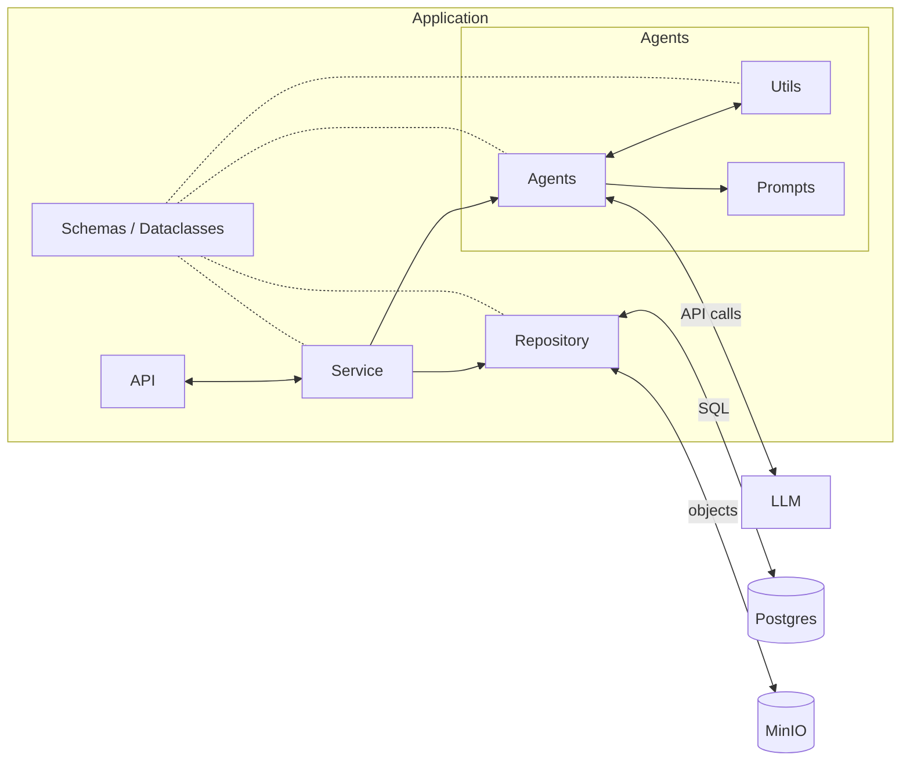

# Storybook Agent

Interactive AI storytelling application where a child uploads a photo of a hand-drawn character and an AI agent turns it into a dynamic, illustrated story.

---

## 1. Project Goal

The goal is to build an agent-driven experience where the user uploads a photograph and the agent is responsible for the rest of the story experience.

This is achieved by giving an LLM a set of tools and prompt skills so it can:

- analyze the uploaded image,
- create and continue the story,
- stream story text progressively,
- generate illustrations,

The agent is wrapped inside an application that provides the structure and runtime utilities, such as:

- the initial upload UI,
- API endpoints,
- story state management,
- hard limits for turns and generated images.

**Visual design:** the UI follows a *Shin Chan: Flipa en Colores*–inspired aesthetic (chunky borders, saturated flat colors, crayon-like illustrations). See [docs/DESIGN.md](docs/DESIGN.md) for the full style guide.

---

## 2. Backend Architecture

The backend is organized in layers. Everything inside the application boundary orchestrates story generation; external systems provide HTTP entry, the LLM, and persistence.

Only **Agents** talks to the **LLM**. Only **Repository** talks to **Postgres** and **MinIO**. The **Service** never calls the LLM or the databases directly.

| Layer | Role |
|---|---|
| **API** | HTTP entry point: auth, multipart input, SSE responses. No business logic. |
| **Service** | Orchestration: prepares input, runs the agent pipeline, persists state, streams events. |
| **Agents** | Pydantic AI layer: LLM calls, tools, and prompt-driven skills. |
| **Utils** | Agent helpers (prompt loading, image helpers, shared utilities). |
| **Prompts** | System and task prompt templates used by agents. |
| **Repository** | Data access: story state in Postgres, images in MinIO. |
| **Schemas / Dataclasses** | Shared language between layers (`Image`, `Scene`, `StoryState`, deps). |

---