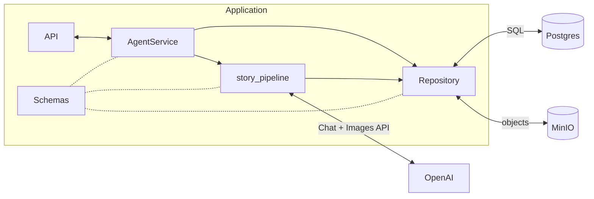

# Storybook Agent

Interactive AI storytelling application where a child uploads a photo of a hand-drawn character and an AI agent turns it into a dynamic, illustrated story.

---

## Quick start

```bash
cp .env.example .env          # set JWT_* and API_KEY_ENCRYPTION_KEY (see DEVELOPMENT.md)
just update                   # build + start Docker stack
docker compose exec backend alembic upgrade head
```

Open http://localhost:5173 → register → add and **select** an OpenAI API key → **Nueva historia**.

| Service | URL (defaults) |
|---|---|
| App | http://localhost:5173 |
| API docs | http://localhost:8000/docs |
| MinIO console | http://localhost:9001 |
| pgweb | http://localhost:8081 |

---

## Documentation

| Document | Audience | Contents |
|---|---|---|
| [AGENTS.md](AGENTS.md) | AI agents | Repo map, conventions, pipeline entry points |
| [docs/ARCHITECTURE.md](docs/ARCHITECTURE.md) | Developers | Layers, `story_pipeline`, auth, data model |
| [docs/DEVELOPMENT.md](docs/DEVELOPMENT.md) | Developers | Docker, `.env`, `just`, Alembic migrations |
| [docs/DESIGN.md](docs/DESIGN.md) | Designers / frontend | *Flipa en Colores* UI style guide |

---

## Project goal

The goal is to build an agent-driven experience where the user uploads a photograph and the agent is responsible for the rest of the story experience.

This is achieved by giving an LLM a set of tools and prompt skills so it can:

- analyze the uploaded image,
- create and continue the story,
- stream story text progressively,
- generate illustrations,

The agent is wrapped inside an application that provides the structure and runtime utilities, such as:

- the initial upload UI,
- API endpoints,
- story state management,
- hard limits for turns and generated images.

**Visual design:** the UI follows a *Shin Chan: Flipa en Colores*–inspired aesthetic (chunky borders, saturated flat colors, crayon-like illustrations). See [docs/DESIGN.md](docs/DESIGN.md) for the full style guide.

---

## Stack

| Layer | Technology |
|---|---|
| Frontend | React 19, Vite, Tailwind 4, Framer Motion |
| Backend | FastAPI, SQLModel, Alembic |
| Story generation | pydantic-graph + Pydantic AI (`story_pipeline/`) |
| LLM / images | OpenAI Chat + Images API (per-user API key) |
| Storage | Postgres (state), MinIO (images) |
| Runtime | Docker Compose |

---

## Architecture (summary)

The backend is organized in layers. Story generation runs through **`story_pipeline`** (pydantic-graph), orchestrated by **`AgentService`** and exposed as SSE.



| Layer | Role |
|---|---|
| **API** | HTTP entry: auth, multipart input, SSE responses. No business logic. |
| **Service** | Orchestration: prepares deps, runs the pipeline, persists state, streams events. |
| **story_pipeline** | pydantic-graph with Pydantic AI agents (reference vision, scene planner) + background image step. |
| **Repository** | Postgres JSONB state + MinIO image bytes. |
| **Schemas** | Domain types (`Image`, `Scene`, `StoryState`, …). |

Only the **pipeline** calls OpenAI. Only **repositories** talk to Postgres and MinIO.

Full diagrams, SSE contract, and frontend flow: [docs/ARCHITECTURE.md](docs/ARCHITECTURE.md).

---

## Repository layout

```text
StoryBook_Agent/
├── AGENTS.md
├── docs/                  ARCHITECTURE, DEVELOPMENT, DESIGN
├── backend/app/
│   ├── api/v1/            REST + SSE endpoints
│   ├── services/          AgentService, AuthService, …
│   ├── repositories/      Postgres + MinIO
│   ├── schemas/           Domain models
│   ├── story_pipeline/    Active generation graph
│   └── core/              Config, auth, prompts, OpenAI client
└── frontend/src/
    ├── pages/             Home, Dashboard, NewStory, …
    ├── components/book/   Interactive story UI
    ├── components/game/   Shared game-style UI
    └── lib/api.js         API client + token refresh
```

---

## Common commands

```bash
just update          # rebuild + restart frontend & backend
just restart         # restart without rebuild
just logs            # tail app logs
```

See [docs/DEVELOPMENT.md](docs/DEVELOPMENT.md) for migrations, env vars, and troubleshooting.
