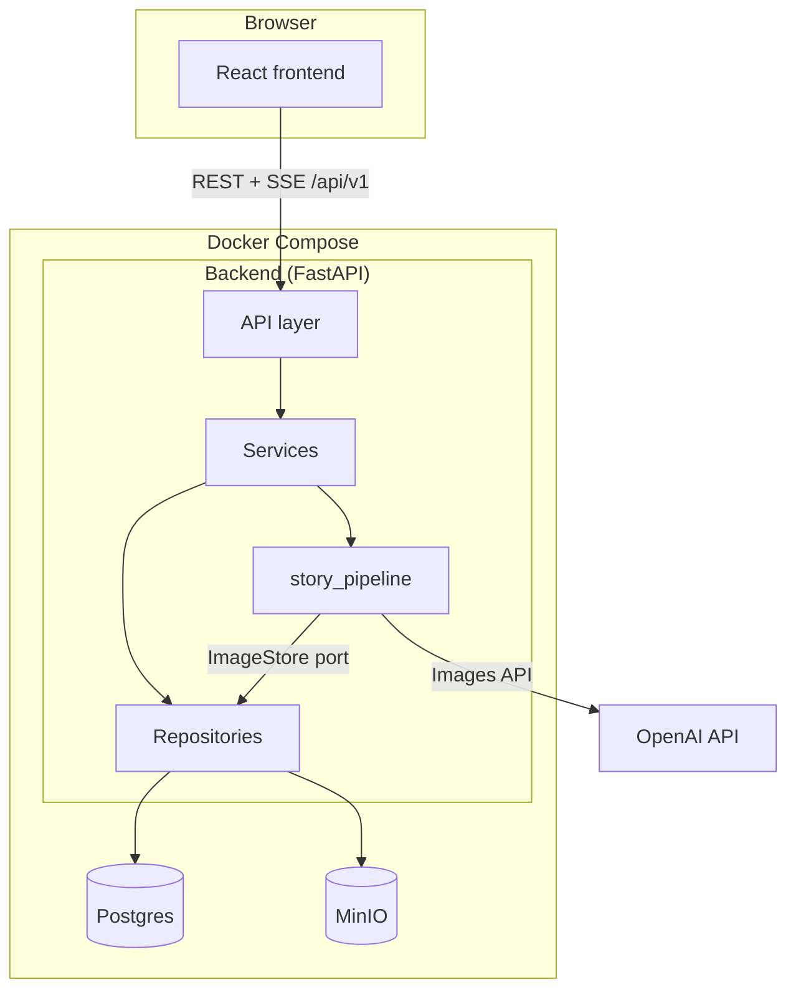
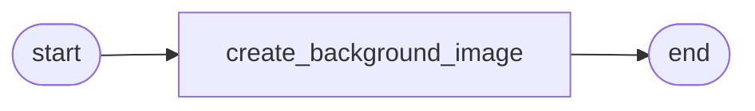

# Architecture

This document describes how StoryBook Agent is structured **today**. For agent-oriented conventions see [AGENTS.md](../AGENTS.md). For running the stack locally see [DEVELOPMENT.md](DEVELOPMENT.md).

---

## System overview



The frontend proxies `/api` to the backend (Vite dev server in Docker). Users authenticate with JWT access tokens (header) + refresh token (httpOnly cookie).

---

## Backend layers

### API (`backend/app/api/v1/`)

Thin HTTP adapters. Responsibilities:

- Parse request bodies (JSON, `multipart/form-data`).
- Enforce authentication via `get_current_user`.
- Delegate to services; return JSON or `StreamingResponse` for SSE.

No business rules, no direct OpenAI or MinIO calls.

### Services (`backend/app/services/`)

| Service | Role |
|---|---|
| `AgentService` | Story continuation: prepare `StoryRunDeps`, stream SSE, persist graph output |
| `AuthService` | Register, login, refresh, logout |
| `ApiKeyService` | Encrypt/store user OpenAI keys; expose selected plaintext key for generation |

Services coordinate repositories and the pipeline. They do not implement graph steps.

### Repositories (`backend/app/repositories/`)

| Repository | Storage |
|---|---|
| `AgentRepository` | `story_histories` JSONB state, user actions, MinIO image objects |
| `UserRepository`, `TokenRepository`, `ApiKeyRepository` | Auth and API keys |

Only repositories talk to Postgres and MinIO directly.

### Schemas (`backend/app/schemas/`)

Shared domain language:

- **`story_elements.py`** — `Image`, `Scene`, `StoryState`, `UserAction`, `StoryHistory` (table).
- **`auth.py`, `user.py`, `api_key.py`** — auth and user DTOs.

Schemas are plain Pydantic/SQLModel types. Pipeline runtime deps (`StoryRunDeps`) live in `story_pipeline/deps.py`, not here.

### Core (`backend/app/core/`)

Cross-cutting infrastructure:

| Module | Purpose |
|---|---|
| `config.py` | Settings from root `.env` |
| `database.py` | SQLModel session |
| `dependencies.py` | `get_current_user`, DB session |
| `security.py` | Password hashing, JWT |
| `openai_client.py` | `AsyncOpenAI` factory per user key |
| `minio.py` | MinIO client |
| `api_key_crypto.py` | Fernet encrypt/decrypt for stored keys |
| `prompt_loader.py` | Load `core/prompts/*.txt` templates |

---

## Story generation: `story_pipeline` (active path)

Story continuation is **not** a monolithic Pydantic AI agent loop. It is a **pydantic-graph** pipeline invoked by `AgentService`.

### Module layout

```
story_pipeline/
├── deps.py           # StoryRunDeps dataclass
├── ports.py          # ImageStore protocol
├── adapters.py       # RepositoryImageStore → AgentRepository
├── graph.py          # Graph definition
├── runner.py         # run_scene_graph() async iterator
├── events.py         # PipelineStep, PipelineEnd, PipelineDone, …
├── serialization.py  # JSON-safe values for SSE
├── steps/
│   └── background.py # OpenAI image generation step
└── agents/           # placeholder for future LLM agent steps
```

### Current graph



- **Input:** `StoryRunDeps` (user, history, action, state, OpenAI client, image store).
- **Output:** `Scene` with `background_image` set.

The background step:

1. Reads scene description from `deps.action.text`.
2. Builds prompt from `core/prompts/background_generator.txt`.
3. Calls `openai_client.images.generate()` with settings `BG_IMAGE_MODEL`, size, quality.
4. Saves raw bytes through `ImageStore.save()` → MinIO + `Image` metadata.

### SSE contract (`POST /stories/continue-history`)

| Event | Payload (summary) |
|---|---|
| `start` | `history_id`, `story_state` |
| `step` | `node_id`, `inputs` |
| `end` | `output` |
| `done` | `history_id`, `output`, `story_state` |
| `error` | `detail` |

Frontend book component consumes these events to update the UI and load images via authenticated image URLs.

### Future: `story_pipeline/agents/`

An empty package placeholder exists for future **Pydantic AI** agent steps (text generation, tool loops). Today all generation logic is in `story_pipeline/steps/`. There is no `core/agents/` directory.

---

## Data model (stories)

### `story_histories` table

| Column | Type | Notes |
|---|---|---|
| `id` | UUID string | `history_id` exposed to client |
| `user_id` | FK → users | Owner |
| `state` | JSONB | Serialized `StoryState` |
| `created_at`, `updated_at` | timestamp | |

`StoryState` shape:

```text
StoryState
├── story_id
├── current_scene: Scene
└── history: Scene[]
```

`Scene` holds `background_image`, `texts`, `images`.

### Images

Binary objects live in **MinIO** (`MINIO_BUCKET`). Metadata (`image_id`, `path`, `url`, `prompt`) is embedded in `StoryState` / `Image` models. URLs for the browser are built against the authenticated API image endpoint, not public MinIO URLs.

---

## Authentication & API keys

```mermaid
sequenceDiagram
    participant U as User
    participant FE as Frontend
    participant API as /auth
    participant DB as Postgres

    U->>FE: login
    FE->>API: POST /auth/login
    API->>DB: verify user
    API-->>FE: access_token + refresh cookie
    FE->>FE: localStorage access_token

    Note over FE,API: Later requests use Bearer header; 401 triggers POST /auth/refresh
```

Each user may store multiple OpenAI API keys (encrypted at rest with `API_KEY_ENCRYPTION_KEY`). One key is **selected** for generation. `continue-history` fails if no key is selected.

---

## Frontend architecture

### Routing (`frontend/src/router/index.jsx`)

Public: `/`, `/login`, `/register`.  
Protected (`RequireAuth`): `/dashboard`, `/nueva-historia`, `/mis-historias`.

### Key UI areas

| Area | Location | Role |
|---|---|---|
| Game shell | `components/game/`, `styles/game-ui.css` | Buttons, brand, backdrop, rainbow |
| Navbar | `components/Navbar.jsx` | Unified white box nav (guest + auth) |
| Story book | `components/book/` | Page turns, SSE, image display |
| API client | `lib/api.js` | JSON requests + token refresh |

Visual design is specified in [DESIGN.md](DESIGN.md).

### New story flow (simplified)

1. User opens `/nueva-historia`, uploads character image and/or enters text.
2. Frontend posts multipart to `continue-history`, reads SSE.
3. On `done`, updates local book state from `story_state`.
4. Background images fetched with `Authorization` header from stories image route.

---

## Infrastructure (Docker Compose)

| Service | Purpose |
|---|---|
| `frontend` | Vite dev server, port `FRONTEND_PORT` |
| `backend` | Uvicorn, port `API_PORT` |
| `db` | Postgres 16 |
| `minio` | Object storage (API + console ports) |
| `pgweb` | Optional DB admin UI |

Persistent volumes: `postgres_data` (bind `./postgres_data`), `minio_data`.

---

## Planned / not implemented

Documented decisions not yet in code:

- Full multi-step LLM story agent (text generation, tool loop) — graph currently has one image step.
- Redis session/cache layer — state is Postgres + browser storage.
- `mis-historias` listing from API — UI placeholder.
- Automatic Alembic on container boot.

When extending the pipeline, add graph steps under `story_pipeline/steps/` and wire edges in `graph.py`.
